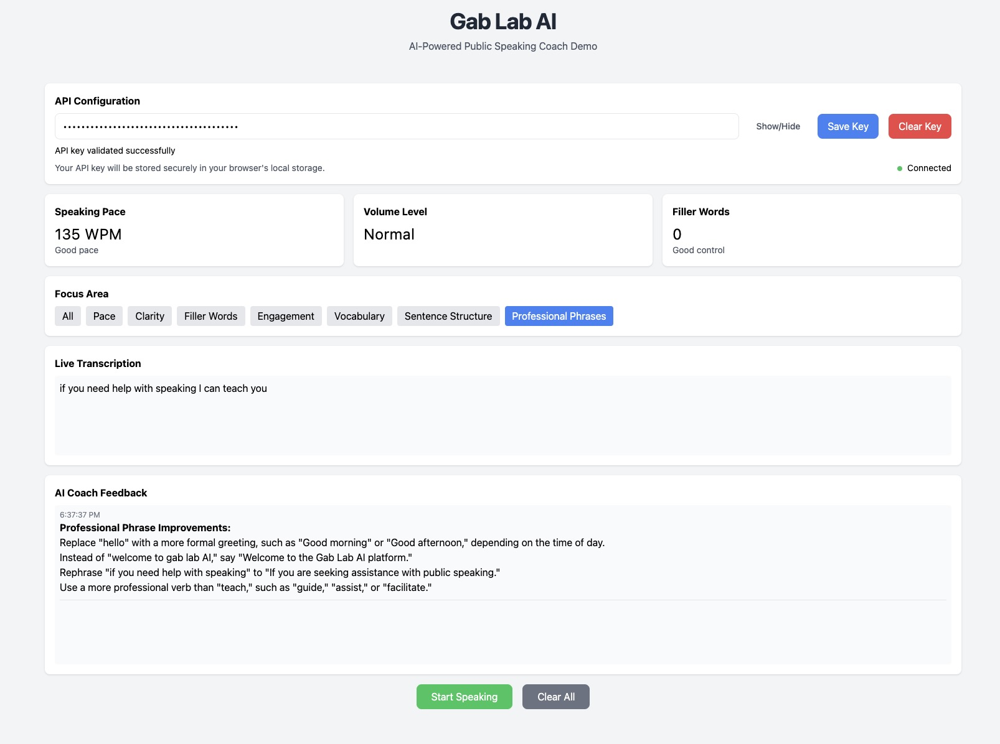

# Gab Lab AI

An AI-powered public speaking coach that provides real-time feedback on your speech patterns, helping you become a more effective communicator.

## Features

- 🎙️ Real-time speech recognition and analysis
- 📊 Live speaking pace tracking (WPM)
- 🔍 Filler word detection
- 🤖 AI-powered feedback using Google's Gemini Pro
- 📝 Multiple focus areas for targeted feedback
- 💾 Secure API key management
- 📱 Responsive design

## Getting Started

### Prerequisites

- A modern web browser that supports Speech Recognition API (Chrome recommended)
- A Google AI (Gemini) API key
- Internet connection

### Setup

1. Clone the repository or download the HTML file
2. Open the HTML file in your web browser
3. Enter your Google AI API key in the configuration section
4. Click "Save Key" to begin

### Getting a Google AI API Key

1. Visit the [Google AI Studio](https://makersuite.google.com/app/apikey)
2. Create or sign in to your Google account
3. Create a new API key
4. Copy the API key for use in Gab Lab AI

## Usage

1. Configure your API key
2. Select a focus area (optional):
   - All (comprehensive feedback)
   - Pace
   - Clarity
   - Filler Words
   - Engagement
   - Vocabulary
   - Sentence Structure
   - Professional Phrases

3. Click "Start Speaking" to begin your session
4. Speak naturally - the app will provide:
   - Real-time transcription
   - Speaking pace analysis
   - Filler word detection
   - Priority alerts for immediate concerns

5. Click "Stop Speaking" to end your session and receive AI feedback
6. Use "Clear All" to reset the session

## Features in Detail

### Speech Analysis
- Speaking pace (Words Per Minute)
- Filler word detection
- Volume level monitoring
- Real-time transcription

### AI Feedback
The AI coach provides targeted feedback based on your selected focus area:
- Speaking pace optimization
- Clarity and enunciation
- Filler word reduction
- Engagement and energy level
- Vocabulary enhancement
- Sentence structure improvement
- Professional phrasing suggestions

## Technical Details

### Built With
- HTML5 Web Speech API
- Google AI (Gemini Pro)
- TailwindCSS
- Markdown-it
- ES6+ JavaScript

### Browser Support
- Chrome (recommended)
- Edge
- Safari (partial support)
- Firefox (partial support)

## Security

- API keys are stored locally in your browser
- No data is permanently stored
- All processing happens in real-time
- Speech data is only sent to Google AI for feedback generation

## Contributing

Contributions are welcome! Feel free to:
- Report bugs
- Suggest new features
- Submit pull requests

## License

This project is licensed under the MIT License - see the LICENSE file for details.

## Acknowledgments

- Google AI for the Gemini Pro API
- Web Speech API for speech recognition
- TailwindCSS for styling
- The open-source community

## Support

For support:
1. Open an issue on GitHub
2. Check existing documentation
3. Review browser console for technical issues

---

Made with ❤️ by Ben